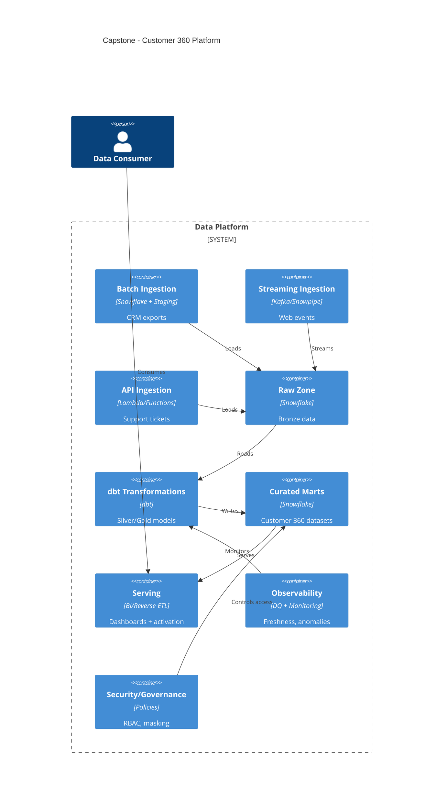

# Capstone Architecture (High Level)

## C4 Container View (Mermaid)

## Key Decisions

- Snowflake as primary store (raw → curated)
- dbt for transformations and testing
- Dedicated warehouses for ETL vs BI
- SLA-driven observability and runbooks
