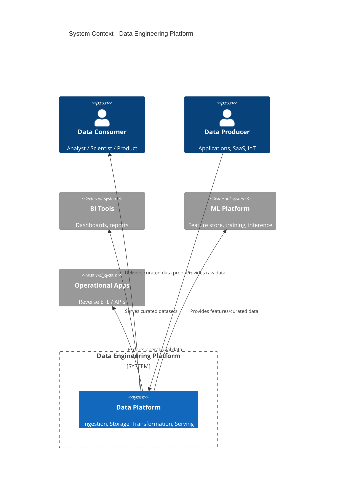
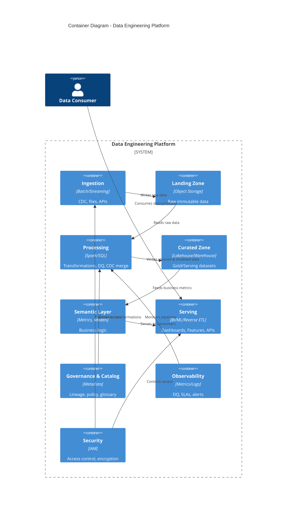
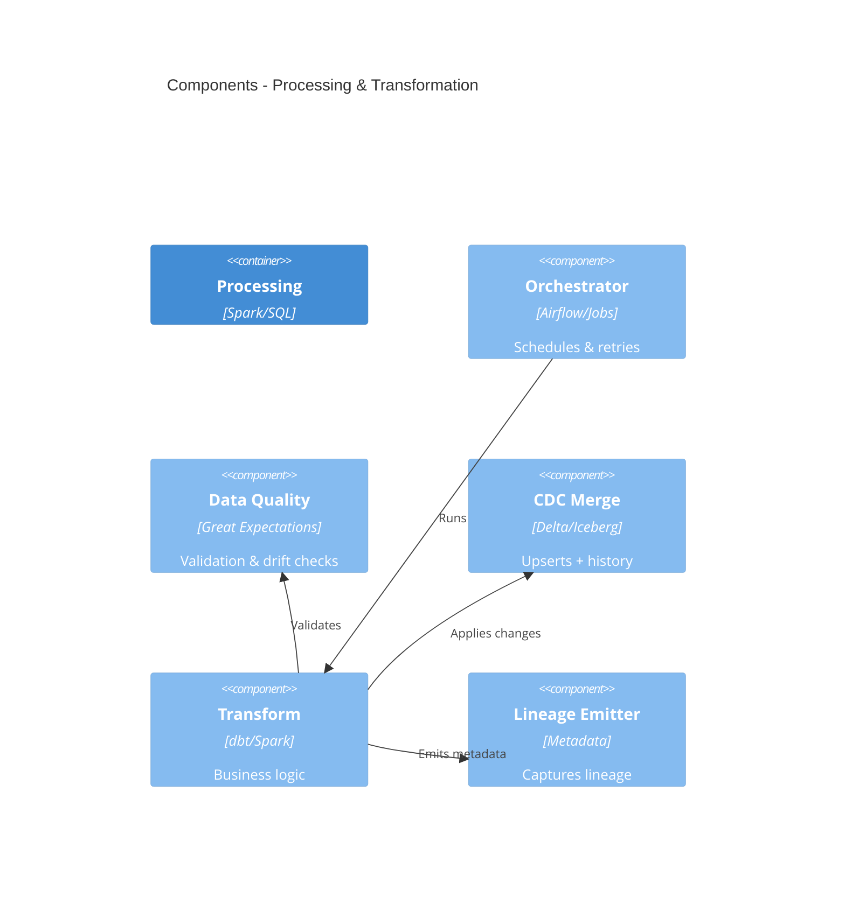

# Data Engineering Solutions Architecture (High Level)

This document provides a **high-level architecture** view of an end-to-end data engineering lifecycle. It uses **C4-style diagrams** (renderable with Mermaid) and narrative guidance that you can tailor to specific platforms (Databricks, Snowflake, BigQuery, etc.).

## Goals

- Provide a shared architecture language across the lifecycle
- Clarify responsibilities and system boundaries
- Highlight key data engineering concerns (quality, governance, observability, security)

## Lifecycle Overview

The lifecycle is organized into the following major stages:

1. **Data Sources** (internal + external)
2. **Ingestion & Landing** (batch + streaming)
3. **Storage & Compute** (lakehouse/warehouse)
4. **Transformation & Modeling** (data products)
5. **Serving & Access** (BI, ML, APIs)
6. **Governance, Security & Observability** (cross-cutting)

---

## C4 Context Diagram (L1)

---

## C4 Container Diagram (L2)

---

## C4 Component Diagram (L3) - Processing Container

---

## Cross-Cutting Concerns

### Governance & Security

- **Catalog + Glossary**: standardized names, ownership, stewardship
- **Access Control**: RBAC/ABAC, row/column masking
- **Compliance**: PII tagging, retention, audit trails

### Observability

- Pipeline health metrics (latency, throughput)
- Data quality checks (nulls, ranges, freshness)
- SLA/SLO reporting + alerting

### Reliability

- Idempotent ingestion patterns
- Backfills and late-arriving data handling
- Checkpointing for streaming

---

## Data Product Lifecycle (Suggested Workflow)

1. **Define**: business domain, data product contract, SLAs
2. **Ingest**: batch/stream ingestion to landing
3. **Model**: transformations + dimensional/data vault patterns
4. **Validate**: DQ checks, governance approvals
5. **Serve**: BI/ML/Reverse ETL consumption
6. **Monitor**: observability, cost, performance

---

## Recommended Diagram Extensions

- **Deployment (L4)**: cloud region + VPC boundaries
- **Data Flow Diagram**: event streams + batch flows
- **Security Diagram**: secrets management, key rotation, encryption

---

## How To Use

1. Use the diagrams above for stakeholder alignment
2. Replace tool references with your platform equivalents
3. Extend with domain-specific data products
